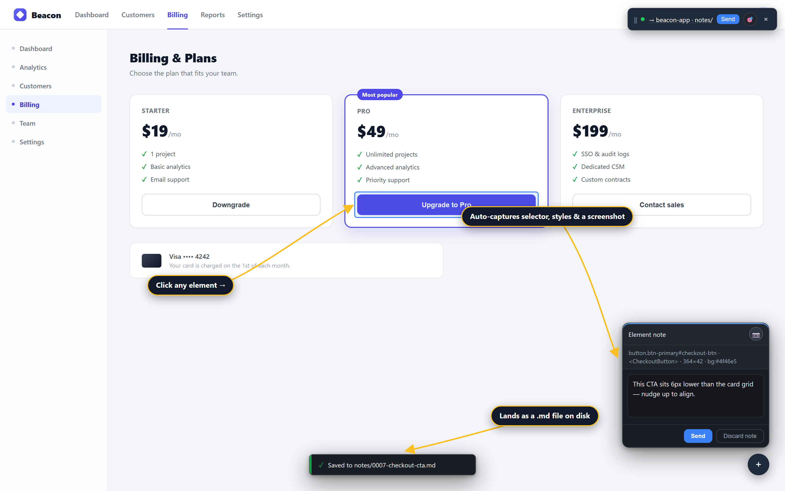
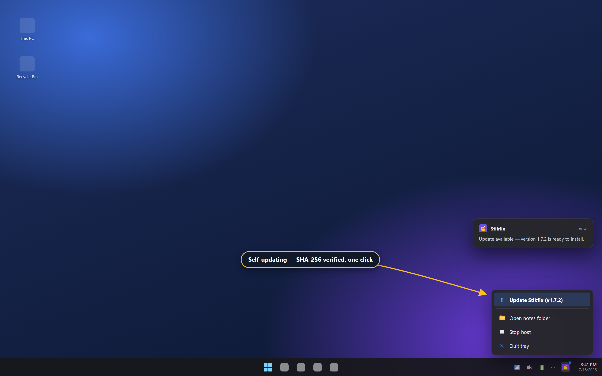
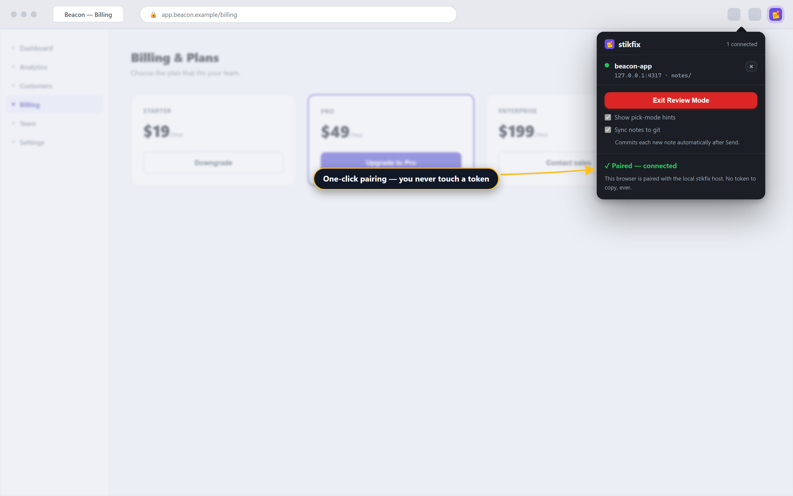
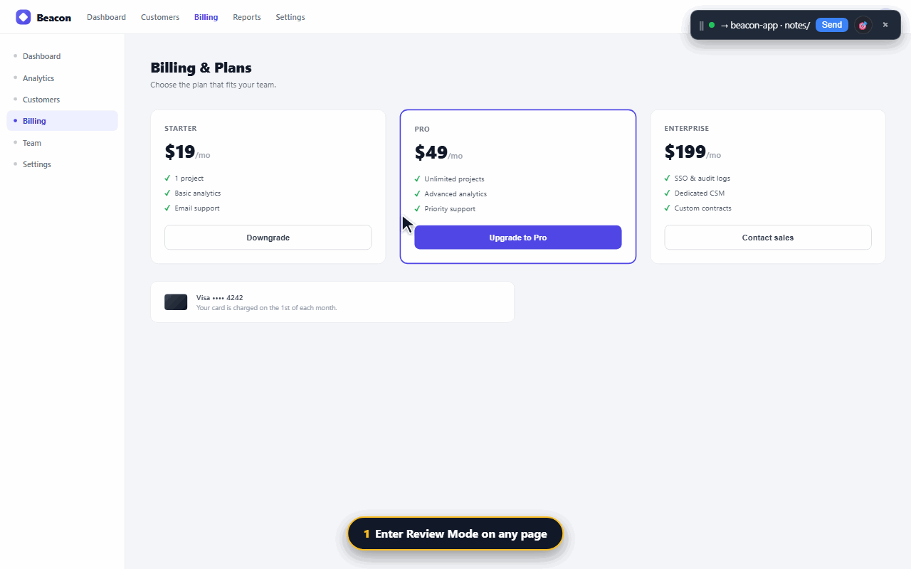
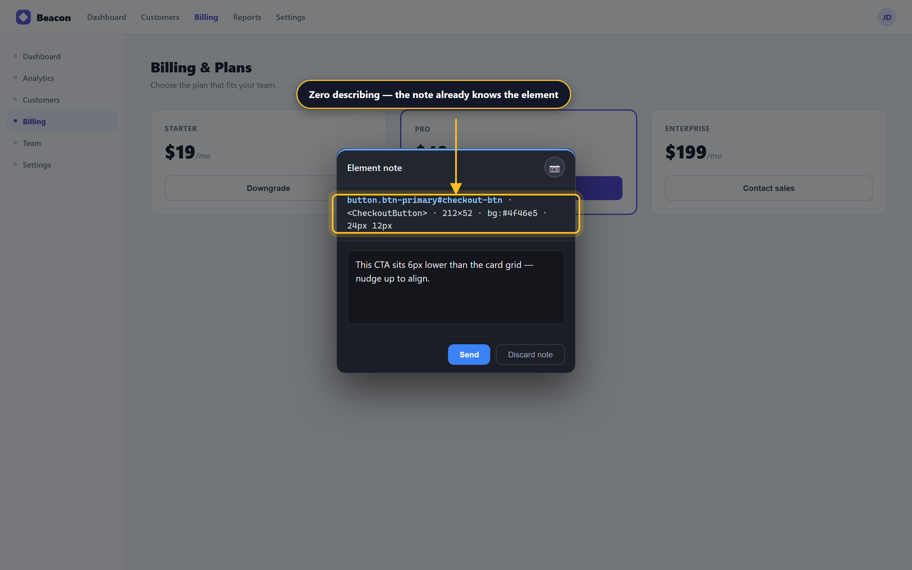
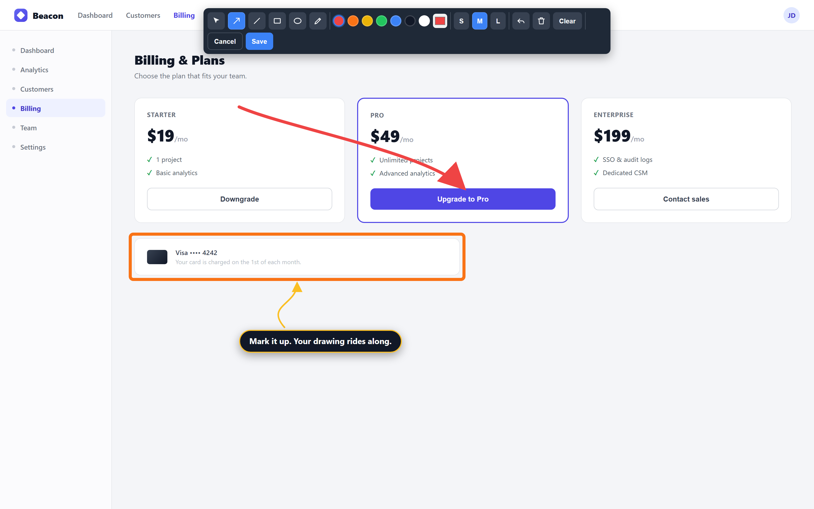
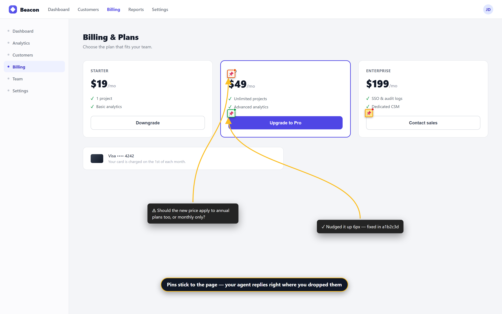
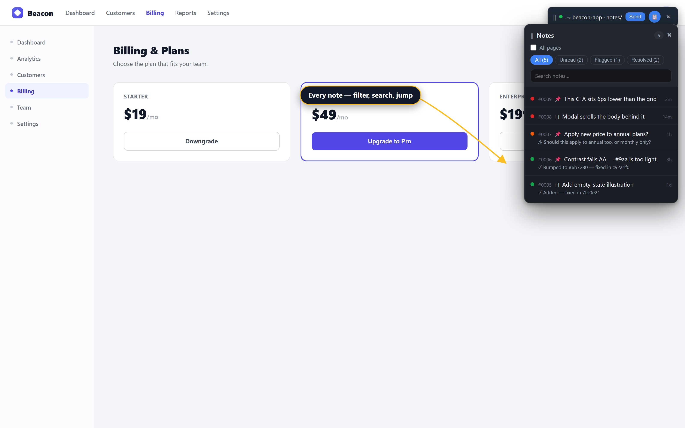

# Getting started with stikfix

**Stick a note on any web page. Your AI coding agent reads it and fixes it. That's the whole loop.**



## What you get

- **Drop a note on the exact thing** that's wrong — free-floating, or anchored to a DOM element — instead of screenshotting and typing a paragraph to describe it.
- **It lands on disk as a precise `.md` file** in your project's `notes/` folder, with selector, computed styles, `outerHTML`, and a screenshot already attached. Nothing to describe by hand.
- **Your agent reads it, fixes it, and replies** — right in the file. No fix gets lost three screens up a chat log.
- **The pin turns green ✓ on the page**, with the agent's one-line reply on hover. Anything ambiguous turns amber with a clarifying question instead of a guess.

Everything runs on `127.0.0.1`. No cloud, no accounts — your code and your notes never leave your machine.

## Install — Windows (the 2-minute path)

This is the one-click route: download an installer, run it, done.

1. Grab the latest **`stikfix-setup-<version>.exe`** from the [releases page](https://github.com/omernesh/stikfix/releases/latest).
2. Run it. It asks for **administrator rights** — it needs them to write the browser policy that installs the extension for you.
3. Choose a setup type:
   - **Complete** — host + extension in every Chromium browser it finds (Chrome/Edge/Brave) + run-on-login + desktop shortcut. Fully automatic, no terminal.
   - **Custom** — pick components and tasks individually, and choose your **notes folder**.
4. The wizard also offers **"Install the review-notes skill for Claude Code"** — take it, and your agent already knows how to process notes the moment setup finishes.
5. It finishes with a **post-install health check**, verifying the host is bound, native messaging is registered, the browser policy is set, and the notes folder is writable.
6. Open Chrome/Edge/Brave. The extension is already there. You'll see **"Installed by your organization"** next to it — that's expected, not a warning; it's how a self-hosted, force-installed extension always looks.

The host starts automatically and shows up as a **system-tray icon** — green means it's running. That same icon is where updates land later.



Re-run `stikfix-host.exe doctor` anytime, or use the **"Stikfix Health Check"** Start menu shortcut. To remove everything, use Windows **Add or remove programs**.

## Install — macOS / Linux / from source (the `npx` path)

Same destination, by hand — this is the path for macOS, Linux, or building the extension from source on Windows.

**1. Install the host:**

```bash
npx stikfix init --root /path/to/your/project
```

One command registers the native-messaging host for Chrome and Edge, writes config pointing at your project, drops a **"Stikfix Host" launcher on your Desktop**, prints your stable **extension ID**, and auto-installs the **review-notes** skill (`--no-skill` to skip it).

**2. Load the extension:**

1. Open `chrome://extensions` (or `edge://extensions`) and turn on **Developer mode**.
2. Click **Load unpacked** and pick `.output/chrome-mv3/` from this repo.

**3. Start the host:** double-click the **Stikfix Host** Desktop launcher. Double-clicking again is safe — it won't spawn a duplicate.

**4. Pair:** open the popup and click **Pair with host**. The token moves over native messaging automatically — you never see it, never paste it.



## Your first note (the loop)



1. Open your app, click **Enter Review Mode**.
2. Drop a **free note** anywhere, or click an element to anchor one — anchoring auto-captures the selector, styles, `outerHTML`, and a highlighted screenshot.
3. Tell your agent **"read my notes."**
4. Watch the pin turn **green ✓** with the agent's reply on hover — or **amber** if it needs you to clarify something.



Drop more notes, repeat. Pins update live as the agent works — no reload needed.

## The features, in pictures

**Element notes & context capture** — click any element and stikfix captures a robust CSS selector, computed styles, `outerHTML`, bounding box, and the React component name, plus an auto-highlighted screenshot showing exactly what you meant.


**Annotation drawing** — freeze the current view and draw an arrow, box, circle, line, or freehand mark right on the screenshot. It flattens into the image your agent sees — pixel for pixel.



**On-page pins & two-way status** — pins stay put across reloads: yellow (unread), amber (flagged, agent has a question), green ✓ (resolved, agent's reply on hover).



**Notes panel** — every note for the page (or the whole project) with status counts, filter chips, search, and click-to-jump.



**Auto-update & system tray** — the extension updates itself via Chrome policy; the host offers a SHA-256-verified one-click update from its tray icon.


A few more worth knowing: **region/marquee capture** for a cropped screenshot of just the area you care about, **per-origin project routing** so every tab lands in the right project's `notes/` folder automatically, **git-sync mode** for working notes across two computers, and a **cross-browser host** that registers Chrome and Edge in one pass.

## Wire up your AI agent

The **review-notes** skill is the agent half of the loop. Both install paths above set it up automatically at `~/.claude/skills/review-notes/SKILL.md` — available in every Claude Code project, no manual copy.

Using Cursor, Codex, or another folder-reading agent instead? Point it at `skill/SKILL.md` in this repo — it's plain markdown, nothing Claude-specific.

Any of these kicks it off — including the **`/review-notes`** slash command in Claude Code:

- `/review-notes`
- "read my notes"
- "process review notes"
- "fix sticky notes"
- "what notes do I have"

Under the hood, it works through unread notes **oldest-first**, applies each fix, writes a `reply` into the note, and marks it **resolved** (or **flagged** if something's ambiguous). Re-running on a clean directory just says "no unread notes" — safe to fire any time.

## Staying current

- **Extension** — auto-updates silently via the browser's enterprise policy, exactly like a Web Store extension.
- **Host** — checks GitHub every ~6 hours. When a new version lands, the tray icon offers **Update Stikfix (vX.Y.Z)** — one click downloads the installer, **verifies its SHA-256**, and applies it. Your notes folder and settings are preserved.

## Privacy

Everything runs on `127.0.0.1`. No cloud, no accounts, nothing to sign up for — your code and your notes never leave your machine.

Full details: [README.md](../README.md) · [LICENSE](../LICENSE)
